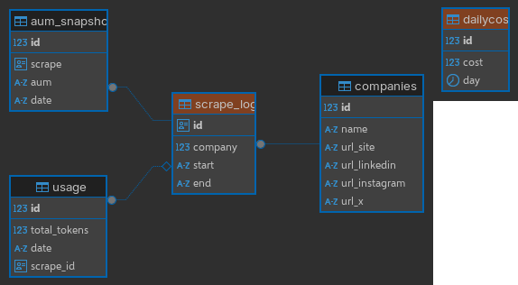

## Teste Tecnico Anka Tech

Aplicação coleta automatica de Patromônio

## Como instalar

1. Instale o [Docker](https://docs.docker.com/install/)
2. Instale o [Docker Compose](https://docs.docker.com/compose/install/linux/)
3. Clone o repositorio
4. Copie os arquivos .env.example para .env
5. Execute o comando `docker compose up --build -d`
6. Fim

## Documentação da API

. Link da documentação da API: [Link](https://www.postman.com/cryosat-candidate-18825323/anka-teck/collection/bv3yn6n/anka-tech?action=share&creator=33276918)

## Tecnologias Utilizada

    . Python 3.11
    . FastAPI
    . Sqlalchemy
    . Psycopg
    . Alembic
    . Agno
    . Docling
    . PyTest

## Diagrama do Banco de dados



## Documentação da API 2

Url base: http://localhost:5000

```http
    POST /upload
    HEADERS
        Content-Type: multipart/form-data
```

```http
    GET /usage/today
```

Realizar rescrape:

```http
    POST /usage/today
```

## Como executar testes

    1. execute o comando na raiz do projeto: PYTHONPATH=. pytest -s

## Outras instruções

    .O arquivo csv de base está em ./backend/companies.csv
    .O relatorio de resultado está em: ./backend/reports/relatorio.xlsx
